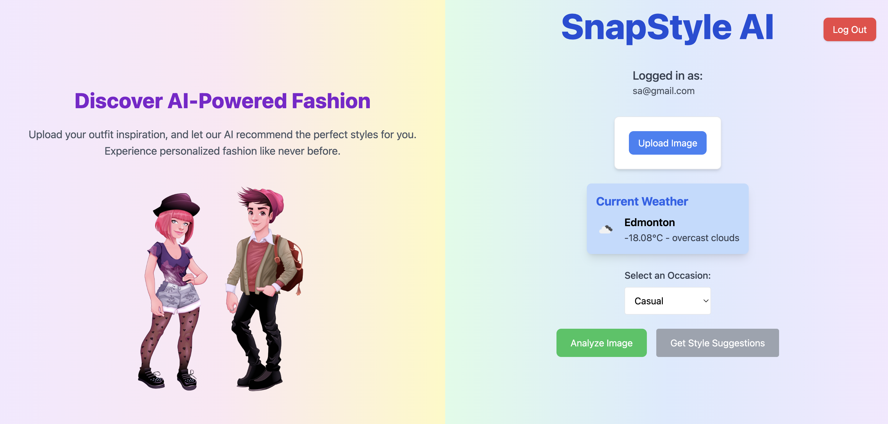
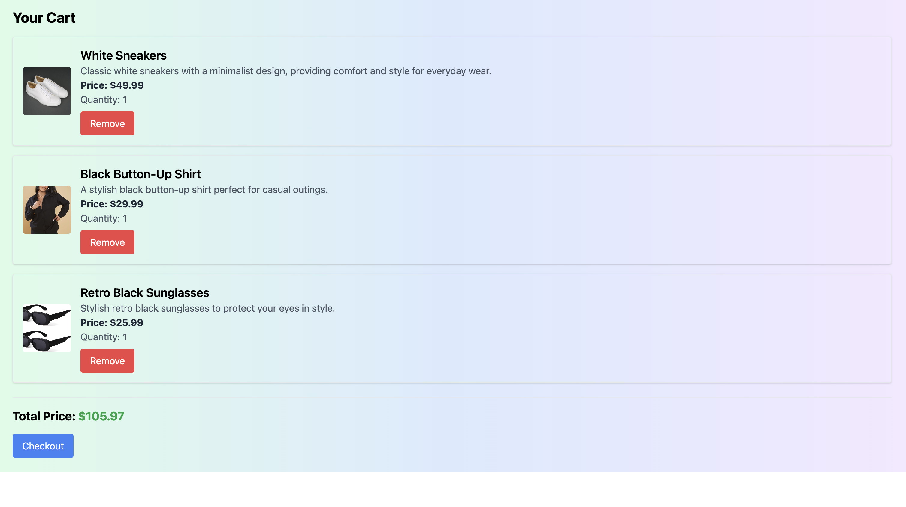

# 📸 SnapStyle AI

SnapStyle AI is an AI-powered web application that transforms your fashion inspiration into personalized style recommendations. 🌟 Whether you're looking for outfits for a specific occasion or just want to explore trends, SnapStyle AI has you covered. 🚀

---

## 🔗 Live Demo

🌐 [SnapStyle AI](https://snapstyle-ai.netlify.app)  

---

## 🛠️ Features

### 🎨 **Style Recommendations**
- Upload your favorite fashion inspiration image. 🖼️
- Get personalized style suggestions tailored to occasions like casual, formal, or party. 🛍️

### 🌦️ **Weather Integration**
- Provides weather-based recommendations. ☀️🌧️❄️

### 🛒 **Cart & Wishlist Management**
- Add items to your cart for instant purchase. 🛒
- Save your favorite styles in your wishlist to buy later. 💖

### 💳 **Stripe Payment Integration**
- Seamless payment processing with Stripe. 💳

### 🔑 **Authentication**
- Secure login and signup using Firebase Authentication. 🔐

### 🧵 **Responsive Design**
- Beautiful UI optimized for desktop, tablet, and mobile devices. 📱💻

---

## 🏗️ Tech Stack

### 🖼️ **Frontend**
- **React**: Component-based architecture.
- **Tailwind CSS**: Styling and responsive design.
- **React Toastify**: User notifications.

### ⚙️ **Backend**
- **Node.js**: High-performance server-side runtime for executing server-side JavaScript code.
- **TypeScript**: Static typing for enhanced developer experience and maintainability.
- **Netlify Functions**: Serverless architecture for API endpoints.
- **Stripe API**: Payment gateway.

### 🗄️ **Database**
- **Firebase Firestore**: Storing cart and wishlist data.

### 🌐 **Deployment**
- **Netlify**: Continuous Deployment and hosting.

---

## 🖼️ Screenshots

### Homepage


### Results Page


### Wishlist


### Cart


---

## 🔧 Installation & Setup

1. Clone the repository:
   ```bash
   git clone https://github.com/Shikhararora19/snapstyle-ai.git
   ```

2. Navigate to the project directory:
   ```bash
   cd snapstyle-ai
   ```

3. Install dependencies:
   ```bash
   npm install
   ```

4. Create a `.env` file in the root directory and add the following environment variables:
   ```env
   REACT_APP_FIREBASE_API_KEY=your_firebase_api_key
   REACT_APP_FIREBASE_AUTH_DOMAIN=your_auth_domain
   REACT_APP_FIREBASE_PROJECT_ID=your_project_id
   REACT_APP_FIREBASE_STORAGE_BUCKET=your_storage_bucket
   REACT_APP_FIREBASE_MESSAGING_SENDER_ID=your_sender_id
   REACT_APP_FIREBASE_APP_ID=your_app_id
   STRIPE_SECRET_KEY=your_stripe_secret_key
   ```

5. Start the development server:
   ```bash
   npm start
   ```

6. Visit the app at `http://localhost:3000`.

---

## 🔌 API Endpoints

### 🔹 **/create-payment-intent**
- **Method**: POST
- **Description**: Creates a payment intent using Stripe.
- **Payload**:
  ```json
  {
    "amount": 1000,
    "currency": "usd"
  }
  ```

---

## 🚀 Deployment

1. Build the project:
   ```bash
   npm run build
   ```

2. Deploy the `/build` folder to Netlify.

3. Ensure the `_redirects` file is added to the `public` folder:
   ```plaintext
   /*    /index.html   200
   ```

---


## 🌟 Future Enhancements

- 🧠 **AI Integration**: Improve recommendations using advanced machine learning models.
- 🌐 **Multi-language Support**: Add support for more languages.
- 🛍️ **Order History**: Allow users to view past purchases.
- 📦 **Product Reviews**: Enable users to leave feedback on styles.

---

## 🛡️ Security

- Uses Firebase Authentication for secure user management.
- All payments processed securely through Stripe.

---

## 🤝 Contribution Guidelines

1. Fork the repository.
2. Create a new branch for your feature:
   ```bash
   git checkout -b feature-name
   ```
3. Commit your changes:
   ```bash
   git commit -m "Add new feature"
   ```
4. Push to your branch:
   ```bash
   git push origin feature-name
   ```
5. Open a pull request.

---

## 📜 License

This project is licensed under the MIT License. See the [LICENSE](LICENSE) file for details.

---

## 📧 Contact

For inquiries or feedback, please reach out to:
- **Author**: Shikhar Arora
- **Email**: [shikhar3@ualberta.ca](mailto:shikhar3@ualberta.ca)
- **GitHub**: [Shikhararora19](https://github.com/Shikhararora19)

---

## ⭐ Acknowledgements

- Icons and illustrations by [Freepik](https://www.freepik.com).
- Styling powered by [Tailwind CSS](https://tailwindcss.com).
- Hosting and deployment via [Netlify](https://www.netlify.com).

Thank you for using SnapStyle AI! Let’s revolutionize the way we shop for fashion together! 🎉
